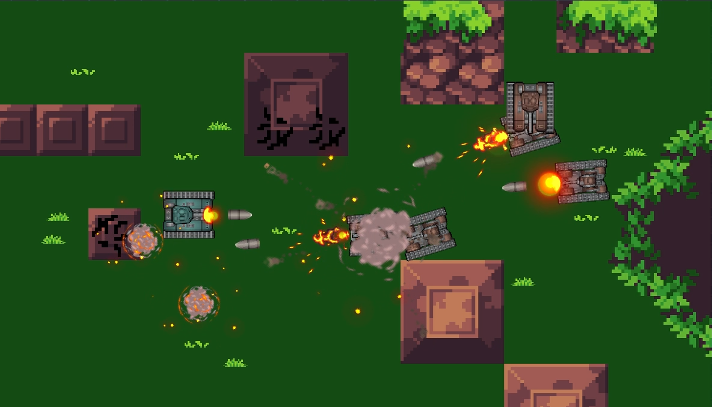
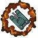
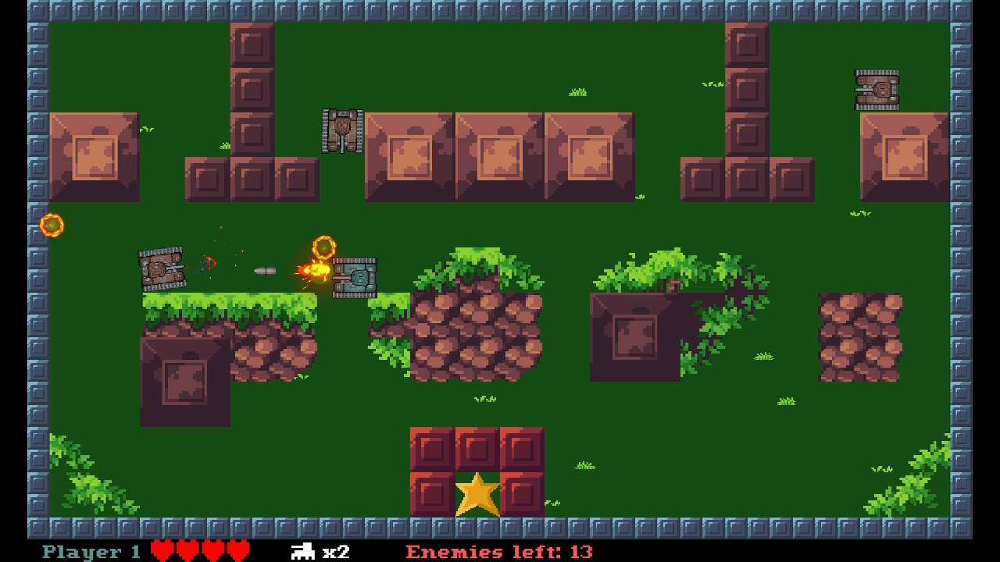
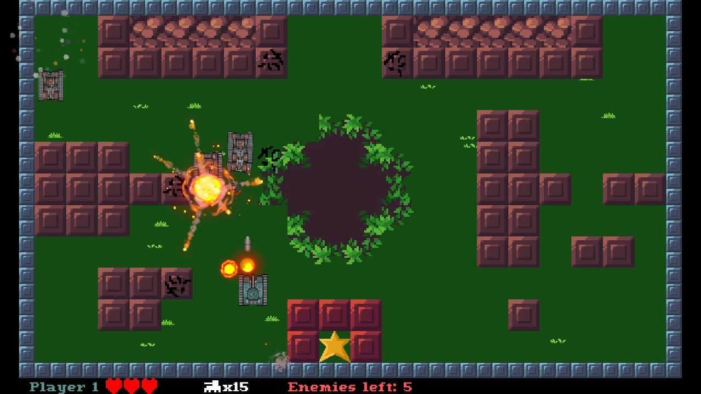
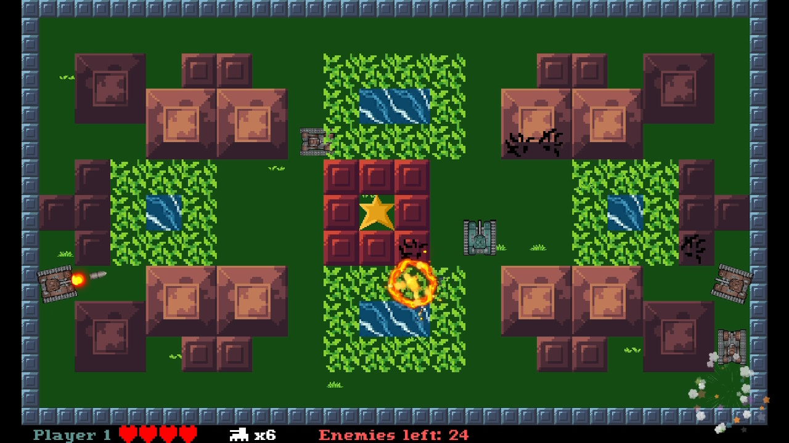
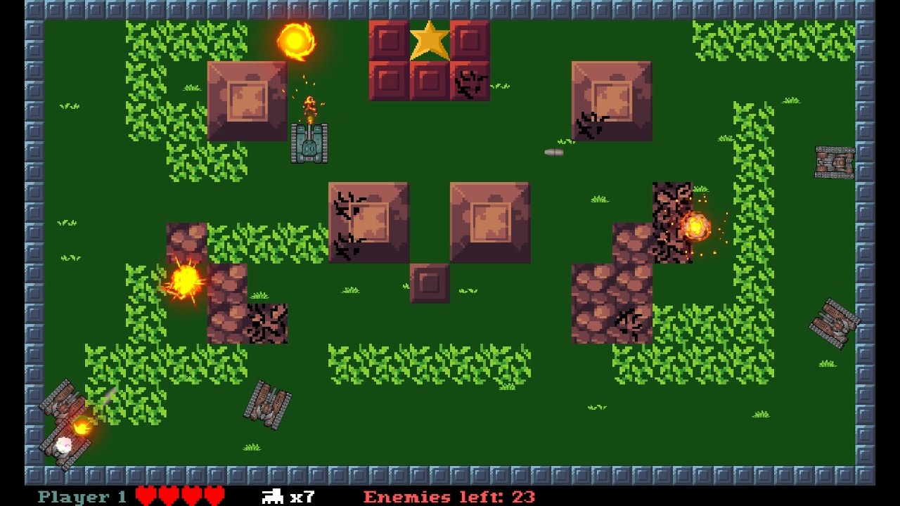

<h1>PANZER!</h1>

<table>
<tr>
  <td>
PANZER! is an arcade shoote-em-up game with tanks, inspired by classic Battle City / Tank 1990 game from NES console.

It offers 20 action-filled levels in which you alone (or with your friend) is all that is standing against divers horde of enemy tanks and your gold start. You need to protect it at all cost!

- 20 levels
- 4 types of tanks that players can gain control over through power-up system
- 6 enemy types
- single player or co-op for 2 players

PANZER! is made using microStudio and can be played in the browser directly through project's website!  
https://microstudio.dev/i/Sebastian/panzer/  
or on itch.io:  
https://funthingshappen.itch.io/panzer  

There's also a YouTube series about the creation process behind the game  
https://www.youtube.com/playlist?list=PLfvzVqACVYiYJGH1bllJK7QN3jeBiE43V

The game's available on itch.io, too!  
https://funthingshappen.itch.io/panzer
  </td>
  <td>

  </td>
</tr>
</table>
